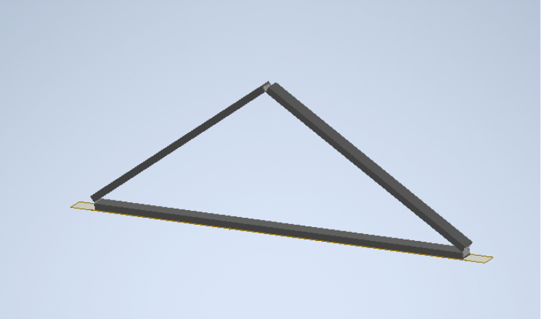
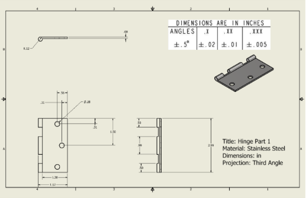
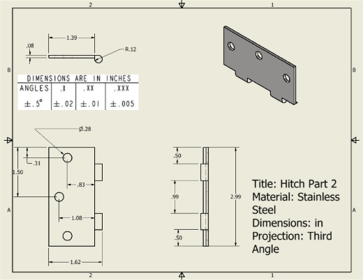
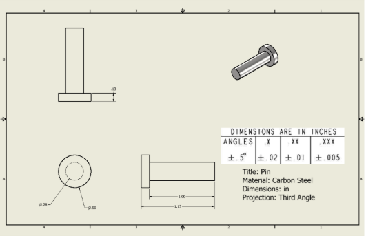
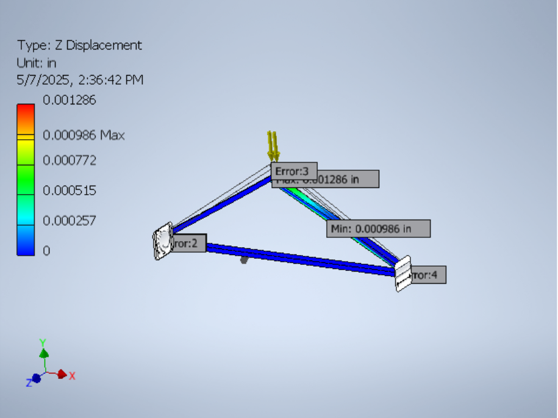
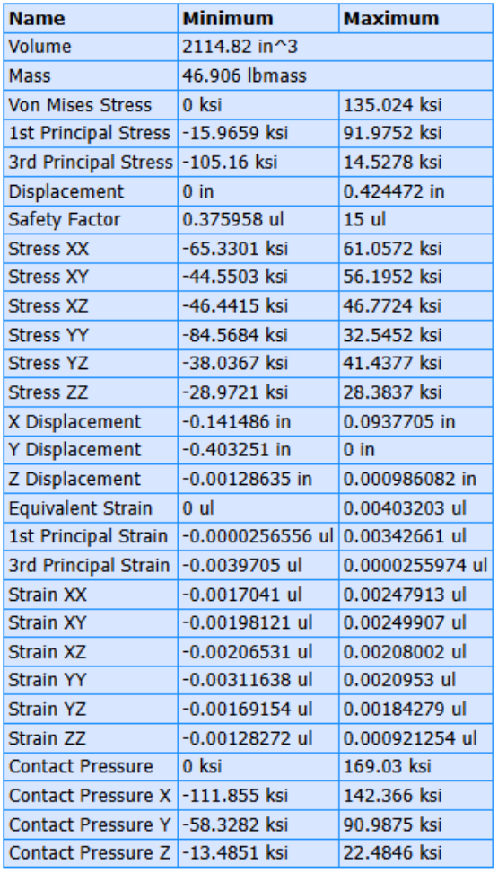
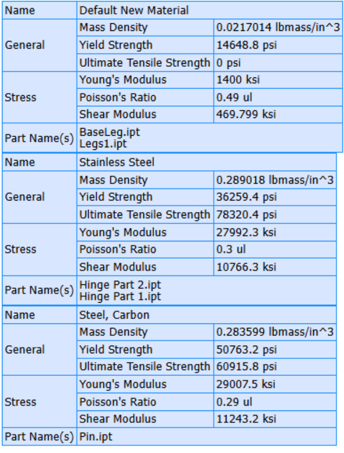
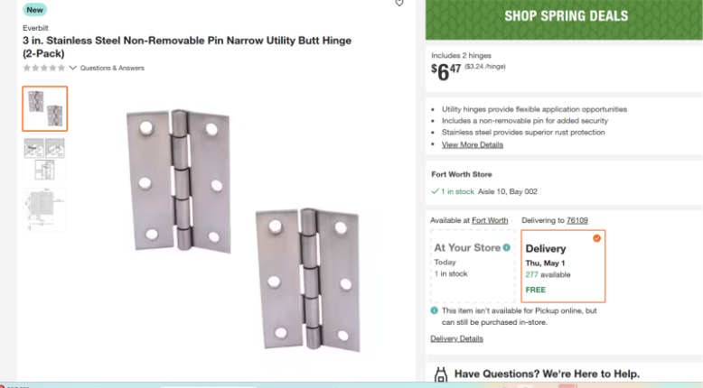
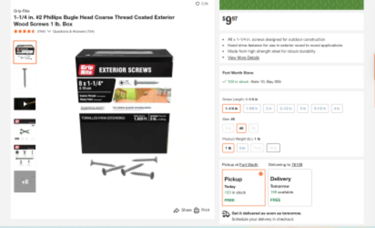

# Bridge-Deflection-Project
In a class we were to design a bridge for as cheap as possible under a specific max deflection. My task was to find the bridge design we would use, so to do that, I made a python script to find the ideal bridge given the materials one of the partners found. This can be found in the jupiter notebook script with example data already generated. After finding the ideal bridge, our team did the manual bridge analysis in MATLAB and did the FEA analysis in Inventor as well.
There is more that can be done with multi-material optimization and adding buckling analysis. Below is an excerpt from our report. The Inventor, MATLAB, and Python script can be found in their respective folders
The key highlights of the python script is programatic truss generation and the ability to import and export from excel, in addition to the ability to view all the trusses as they are and in a 2D deflection vs cost analysis; and a 3D deflection vs height vs vertical segments overlayed with the cost.

Here are some examples from the program:
./media/truss.png
./media/2D.png
./media/3D.png

# FEM Design Final Project

**Solid Mechanics II**  
**ENGR 20623-005**  
**5/5/2025**

---

## Introduction

As a continuation of our previous FEM Project, we have moved on to analyzing the connection parts for our truss design. In the following sections there will be an assembly drawing of our joint on the beam, a dimensioned drawing of our connection part, a stress analysis report of our node connection, and a material description of our connection part.

---

## Assembly and Part Dimension drawings

Figure 1 shows an assembly of our joint onto our beam through inventor. Figure 2 (a,b) shows the dimensioned drawings for both components of the hinge joint used in our design. We also show the tolerances of each part included in the drawing. These joints will connect to the beams using several pins shown in the dimensioned drawing in Figure 3.

---

## Stress Analysis

After assembly we can test the performance of the truss through stress analysis in inventor. Figure 4 shows our stress analysis with the constraints from our designed hinge as well as the internal stresses in the truss. Figure 5 shows our stress report generated from our inventor model. From that data we can see the specifications of our design to be able to confirm a working model or find errors that need improvement.

---

## Materials

We modeled our hinge and pins after a similar design from Home Depot that are available online. Although the hinge design is slightly different it will be made from the same material confirming that our part is manufacturable. Along with that, our pins were made from the same material as Home Depot screws showing that they are manufacturable. Figure 6 shows the bill of material generated from the stress analysis report which details the materials of each component of our truss. The Default New Material is the section for our yellow pine beams seen in our original project. Figure 7 (a,b) shows screen shots from Home Depot's website detailing the hinge and screw model parts.

---

## Citations

- Home Depot website for example parts  
- Inventor for part design, assembly, and analysis  
- All other information and tools are accounted for in our original project
